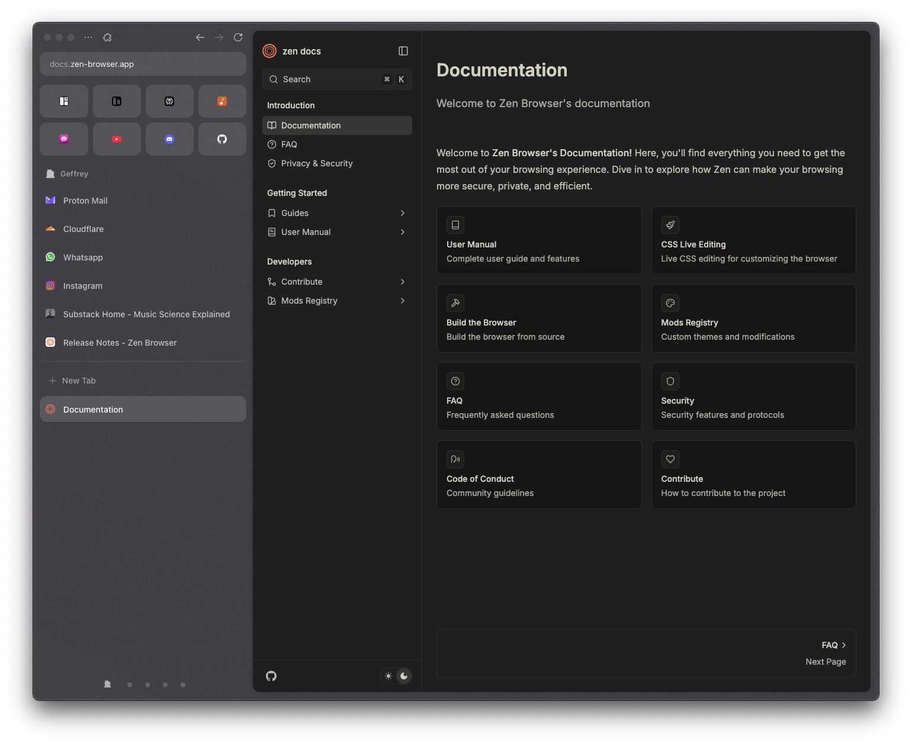

# Zen Browser UserChrome Customizations

A highly opinionated, minimal userChrome.css configuration for Zen Browser (Firefox fork). It's likely you'll need to have the exact settings as I have to make this work well.

## Key Features

### 🎨 Visual Enhancements
- **Enhanced Font Rendering**: Anti-aliased text rendering for clean typography
- **Rounded Corners**: 10px border radius throughout the interface
- **Optimized Spacing**: 14px element separation for better visual hierarchy
- **Cleaner Browser Container**: Fix for smoother clipped content area with rounded corners

### 📐 Layout Improvements
- **Increased Tab Height**: 44px minimum tab height
- **Essential Optimization**: 48px height for essential tabs.
- **Hidden Elements**: Removed clutter by hiding workspace indicators, user context icons, and toolbar items
- **Responsive Grid**: Increased Essentials grid to 4 instead of 3.

### 🏷️ Tab Enhancements
- **Refined Typography**: 14px font size with 500 weight for optimal readability
- **Smart Close Buttons**: Close button (x) on tabs hidden by default, appear on hover
- **Improved Spacing**: Better padding and margins for tab elements

### 🎯 Workspace Customizations
- **Minimalist Indicators**: Inactive workspaces show as small dots instead of full icons
- **Smooth Transitions**: Hover effects reveal full workspace icons with easing
- **Active State Styling**: Silhouette effect for current workspace

### 🔗 URL Bar Refinements
- **Enhanced Padding**: 8px left padding for better text alignment
- **Smooth Transitions**: 0.6s opacity transitions with custom easing

### ⚡ Optimizations
- **Disabled Panel Animations**: Removed all (unncessary) pop-up panel animations for snappier interactions
- **Custom Easing Functions**: Cubic-bezier curves for natural motion on compact mode tabbar
- **Compact Mode Enhancements**: Smooth transitions for compact mode with custom easing
- **Restored Original Firefox Navigation Icons**: I liked the Firefox icons a bit better, less 'thin'.
- **Workspace Button Adjustments**: Improved margins and padding when sidebar is expanded

## Installation

1. Open Zen Browser
2. Type `about:config` in the address bar
3. Search for `toolkit.legacyUserProfileCustomizations.stylesheets`
4. Set the value to `true`
5. Navigate to your profile folder
6. Create a `chrome` folder if it doesn't exist
7. Place the `userChrome.css` file in the `chrome` folder
8. Restart Zen Browser

## Future Considerations

The commented sections at the bottom of the CSS file contain unloaded tab styling that could be enabled for additional visual feedback. I just don't care about knowing whether something is loaded or not.

## Contributing

Feel free to fork this configuration and adapt it to your needs.
